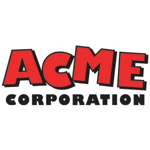
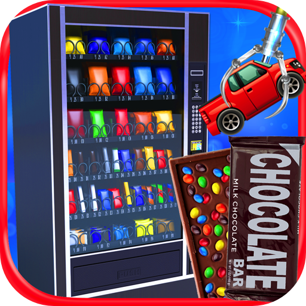

# Feature: Vending Machine

The ACME company introduced a new super-duper vend-o-mat to the market that has to be the best and beat all competition at selling the best candy !

The super-duper vend-o-mat has the following business rules:

**Rule 1**: Accepted coins are 0.05,0.10,0.20,0.50,1.0 and 2.0 euros.

**Rule 2**: Unknown coins are rejected and returned
- Example: Inserting a foreign coin, the coin falls in the tray

**Rule 3**: Inserting a coin increases the user credit
- Example: Inserting 10 cents will result in credit by 0.10€

**Rule 4**: Pressing the reset button will return the user's money

**Rule 5**: Chocolate bars can be added to the machine with their respective price

**Rule 6**: A user can buy a chocolate bar if they have sufficient credit

**Rule 7**: The machine only consumes the user's credit if the chocolate bar falls

**Rule 8**: The machine can be pre-charged with change

**Rule 9**: The machine returns change after a purchase

**Rule 10**: The machine stops the transaction if it cannot return change to the client

**Rule 11**: When returning change the machine chooses the most present denomination
